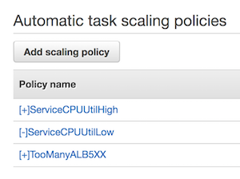

# ecs-cfn-refarch

This is a Amazon EC2 Container Service reference architecture with cloudformation templates that will provision a complete ECS environment with many advanced optional features:

1. standalone service-only ECS environment (simple provisioning)
2. ECS Windows Container(simpole provisioning)
3. ECS CI/CD with Code* and Cloudformation
4. ECS Service Autoscaling and ECS instances host Autoscaling triggered by Cloudwatch alarms
5. Log Consolidation with awslogs driver
6. ECS Events to CloudWatch Events and eventually go to SNS
7. Spot Fleet support
8. [TBD] ASG scaling in triggering ECS container instance draining([link](https://aws.amazon.com/tw/blogs/compute/how-to-automate-container-instance-draining-in-amazon-ecs/))
9. [TBD] credentials management with EC2 Parameter Store([link](https://aws.amazon.com/tw/blogs/compute/managing-secrets-for-amazon-ecs-applications-using-parameter-store-and-iam-roles-for-tasks/))


## service-only 

This cloudformation template will provision common Amazon ECS infrastructure including:

- VPC, IGW, subnets, routing tables, security groups
- IAM role
- Autoscaling Group and Launch Configuration
- Lambda function as custom resource to query latest ECS AMI ID
- ECS Service, Cluster, Task Definition
- [Caddy](https://caddyserver.com/) as the default web server


click the button to launch the demo stack in *us-west-2*

[](https://console.aws.amazon.com/cloudformation/home?region=us-west-2#/stacks/new?stackName=ecs-refarch&templateURL=https://s3-us-west-2.amazonaws.com/pahud-cfn-us-west-2/ecs-cfn-refarch/cloudformation/service.yml)

check the cloudformation output and click the ***LoadBalancerURL*** link to see the result.

For **Amazon ECS Windows Container**, please click the button below:

[](https://console.aws.amazon.com/cloudformation/home?region=us-west-2#/stacks/new?stackName=ecs-win-refarch&templateURL=https://s3-us-west-2.amazonaws.com/pahud-cfn-us-west-2/ecs-cfn-refarch/cloudformation/service-windows.yml)

### Notice

- By default this template will create spot instance(m3.medium). If you need on-demand instance instead, specify ***SpotPrice*** parameter to "**0**"


## complete stack for CI/CD with Amazon ECS


#### 1. Fork the GitHub repository

[Fork](https://help.github.com/articles/fork-a-repo/) this GitHub repository(https://github.com/pahud/ecs-cfn-refarch) into your GitHub account.

From your terminal application, execute the following command (make sure to replace `<your_github_username>` with your actual GitHub username):

```
git clone https://github.com/<your_github_username>/ecs-cfn-refarch
```

This creates a directory named `ecs-cfn-refarch` in your current directory, which contains the code for the Amazon ECS sample app unser `src` directory.


#### 2. Create the CloudFormation stack

click the button to launch the demo stack in *us-west-2*

[](https://console.aws.amazon.com/cloudformation/home?region=us-west-2#/stacks/new?stackName=ecs-refarch-cicd&templateURL=https://s3-us-west-2.amazonaws.com/pahud-cfn-us-west-2/ecs-cfn-refarch/cloudformation/codepipeline.yml)


The CloudFormation template requires the following parameters:

- GitHub configuration
  - **CodeBuildEnvironment**: CodeBuild environment. 
  - **GitHubBranch**: The branch of the repo to deploy continuously. Leave it as default "master"
  - **GitHubRepo**: The name of the github repo to  deploy continuously. Leave it as default "ecs-cfn-refarch"
  - **GitHubToken**: Token for the user specified above. ([https://github.com/settings/tokens](https://github.com/settings/tokens))
  - **GitHubUser**: Your username on GitHub.
  - **ServiceName**: Your ECS Service name.
  - **UseCodeCommit**: If you use CodeCommit instead, select **"yes"** and ignore all GithHub parameters above.


## Scaling from ECS Service Autoscaling

The Cloudformation template will generate a few Service Autoscaling policies for you:

.

## Scaling from Autoscaling Group

The Autoscaling Group will scale out when:

1. The **CPUUtilization** of EC2 instances within the Autoscaling Group is high
2. The **CPUReservation** of ECS Cluster is high
3. The **MemoryReservation** of ECS Cluster is high

**UPDATE** - This refarch will configure the hosts scaling policies just as [Expedia's sharing](https://twitter.com/pahudnet/status/858450488609480704) in AWS Summit Santa Clara 2016([video](https://youtu.be/7r4_Ne7v38o?t=30m53s)).

## Log consolidation

Amazon ECS supports many [docker log drivers](https://docs.docker.com/engine/admin/logging/overview/#supported-logging-drivers), by default, this refarch will use [awslogs](http://docs.aws.amazon.com/AmazonECS/latest/developerguide/using_awslogs.html) and output consolidated logs to Amazon CloudWatch Logs.


## ECS Events

All ECS Events from the ECS Cluster created by this cloudformation template will go to CloudWatch Events rule and then publish to SNS Topic. You can find the SNS Topic in the cloudformation outputs.


###### Reference

Monitor Cluster State with Amazon ECS Event Stream | AWS Compute Blog - https://aws.amazon.com/tw/blogs/compute/monitor-cluster-state-with-amazon-ecs-event-stream/


## Spot Fleet support

By default the ECS cluster in this refarch is provisioned by Autoscaling Group, alternatively, you can select **SpotFleet** in **AutoscalingGroupOrSpotFleet** cloudformation parameter.


When cloudformation provisions the ECS cluster with spot fleet, it will launch the spot instances with [Diversified Allocation Strategy](http://docs.aws.amazon.com/AWSEC2/latest/UserGuide/spot-fleet-examples.html#fleet-config5) with instances type *m3.medium*, *m4.large* and *c4.large*. With the diversity of instance types and multi-AZ allocation, you would not risk losing all ECS cluster with the spot price is lower than the market price - the spot fleet will maintain the desired capacity for you.


###### Reference

Powering your Amazon ECS Clusters with Spot Fleet | AWS Compute Blog - https://aws.amazon.com/tw/blogs/compute/powering-your-amazon-ecs-clusters-with-spot-fleet/